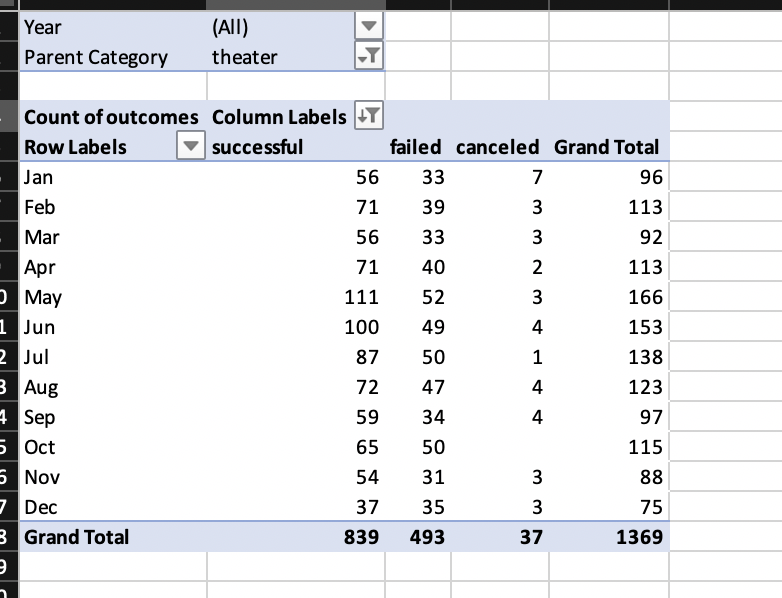
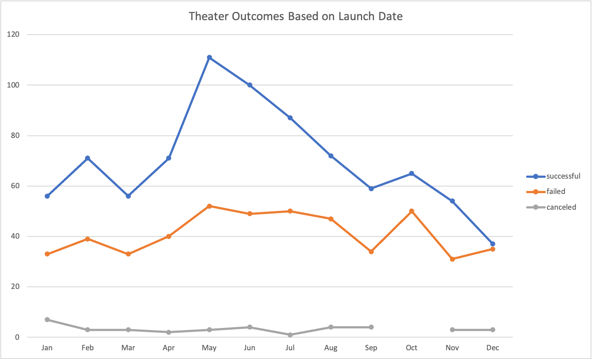
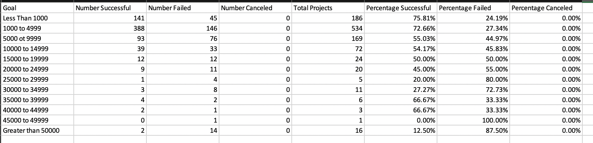
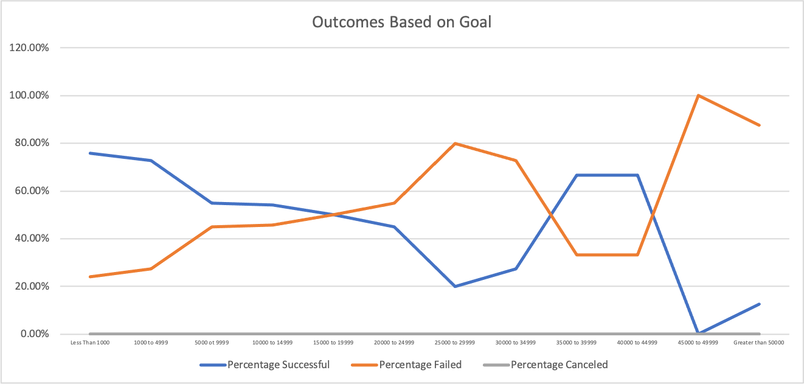

# An Analysis of Kickstarter Campaigns outcomes based on goals and launch date

## Overview of Project

### Purpose
The purpose of this analysis is to investigate the relationship between the campaigns outcomes and their goals and launch dates

## Analysis and Challenges

### Analysis of Outcomes Based on Launch Date
I created a pivot table using the Kickstarter data. I use "Year" and "Parent category" as the filter of the table and set column to "outcomes" and rows to "date created" and get the count of "outcomes" as value. In this way, I could look at numbers of different outcomes on different months. I could also use the filter to look at the result in different year or different parent category. 

A 2-D line chart with markers was used to visualized result. Different months was on x-axis and the the outcomes count was on Y-axis, different line represented percentage successful, failed and cancelled respectively. In this way, we can clearly figure out which month has the most percentage successful or failed.

 
### Analysis of Outcomes Based on Goals
To investigate the relationship between outcomes and goals, I created a table and stratified the goal in to different rows. On different columns, I used Countif formula to count the number of successful, failed and cancelled project for campaigns with different goals. The formula is shown below:

After that I calculated the percentage successful, failed and cancelled project for each goal level by divide the total project number by number of successful, failed and cancelled respectively. The table is shown below

A 2-D line chart was used to visualized result. Different goal level was on x-axis and the percentage was on Y-axis, different line represented percentage successful, failed and cancelled respectively. In this way, we can clearly figure out which goal level has the most percentage successful or failed.

### Challenges and Difficulties Encountered
The first challenge I encountered in assignment was actually with the language setting for Excel. The default language for my laptop is Chinese, so the defualt language for my Excel is in Chinese too. I googled the solution and changed the language successfully to follow the instruction better. The second challenge was that when I type in the countif formula, I tried to find a easier way to copy the fomula from on column or row to another. However the parameter will change when I copy the fomula to the next column. I googled and found that "$" can fixed the problem by fixed the column or row for the parameter. 

## Results

- What are two conclusions you can draw about the Outcomes based on Launch Date?
May has the most number of sucessful outcomes among all months. the number of sucessful projects increase form March to May and decrease from May to September. The numbers of failed cases don't vary a lot among different months. I need to calculate whether the difference is significant to draw more accurate conclusion.

- What can you conclude about the Outcomes based on Goals?
The percentage of successful project is the highest when the goal is the lowest, and the percentage decreases with the goal when the goal is less than 29999. When the goal is between 45000 and 49999, the percentage of successful project is 0% which is the lowest. And the percentage of successful case and failed case have inverse relationship with each other.
- What are some limitations of this dataset?

- What are some other possible tables and/or graphs that we could create?
I may create a currency / country vs outcome graph, it may reveal the influence cultural factor and the liquidity of the currency on the outcome.
